# Tushikane - Humanitarian Community Service Platform

> **Msaada kwa Jamii** - Connecting communities through humanitarian service

A modern, full-stack web application that connects volunteers, donors, and community members to support humanitarian initiatives and community projects.

## 🚀 Live Demo

- **Frontend (Vercel):** http://tushikane.vercel.app/
- **Backend (Render):** https://tushikane-1.onrender.com/
- **Pitch Deck:** [View Pitch Deck](https://gamma.app/docs/Tushikane-Humanitarian-Community-Service-Platform-ibcpl4gpqyjsdy6)

## 📁 Project Structure

```
Tushikane/
├── backend/
│   ├── config/
│   ├── controllers/
│   ├── db/
│   ├── middleware/
│   ├── models/
│   ├── routes/
│   ├── utils/
│   ├── Dockerfile
│   ├── package.json
│   ├── pnpm-lock.yaml
│   ├── seed.js
│   ├── server.js
│   ├── test-mongo.js
│   ├── testDatabase.js
│   ├── testMongo.js
│
├── frontend/
│   ├── public/
│   │   └── images/
│   │       └── logo/
│   │           └── tushikane_logo.png
│   ├── src/
│   │   ├── components/
│   │   ├── pages/
│   │   ├── services/
│   │   ├── styles/
│   │   ├── App.jsx
│   │   ├── App.js
│   │   ├── App.css
│   │   └── main.jsx
│   ├── jest.config.js
│   ├── babel.config.js
│   ├── setupTests.js
│   ├── vite.config.mjs
│   ├── Dockerfile
│   ├── index.html
│   ├── package.json
│   └── pnpm-lock.yaml
│
├── .github/
│   └── workflows/
│       ├── backend.yaml
│       └── frontend.yaml
├── screenshots/
│   ├── about/
│   ├── admin/
│   ├── contact/
│   ├── donors/
│   ├── home/
│   ├── projectpulse/
│   └── volunteers/
├── docker-compose.yml
├── package.json
├── package-lock.json
├── pnpm-lock.yaml
├── README.md
└── vercel.json
```

## 🌟 Project's Best Feature

### ChatHub (Real-Time Community Chat)


**ChatHub** is the heart of Tushikane's real-time community engagement. It allows users to:
- Join the chat instantly by entering a username (no registration required).
- See a list of active users in the sidebar.
- Send and receive messages in real time, powered by WebSockets.
- Enjoy a modern, mobile-responsive UI with smooth gradients and clear message bubbles.

**How it works:**
- When a user joins, they pick a username and are added to the active users list.
- Messages are sent and received instantly for all connected users.
- All chat messages are stored in MongoDB, so users can see recent chat history when they join.
- The interface adapts beautifully to mobile and desktop screens, ensuring a seamless experience everywhere.

---

## 🚀 Deployment

This project is configured for continuous deployment using GitHub Actions.

### Backend (Render)
- The backend is automatically deployed to **Render** from the `backend/` directory.
- The CI/CD pipeline in `.github/workflows/backend.yaml` handles testing, building a Docker image, and deploying.
- A live instance is running on Render, connected to a MongoDB Atlas database.

### Frontend (Vercel)
- The frontend is automatically deployed to **Vercel** from the `frontend/` directory.
- The CI/CD pipeline in `.github/workflows/frontend.yaml` handles testing, building, and deploying to Vercel.
- The production build is optimized by Vite.

## ⚙️ CI/CD Operations

This project uses **GitHub Actions** for continuous integration and deployment:

### Frontend (Vercel)
- Workflow: `.github/workflows/frontend.yaml`
- On every push or pull request to `main` (affecting `frontend/**`):
  1. Installs dependencies and runs tests for the frontend.
  2. Builds the frontend with Vite.
  3. Deploys the production build to Vercel using the Vercel CLI and project secrets.
- Secrets required: `VERCEL_TOKEN`, `VERCEL_PROJECT_ID`, `VERCEL_ORG_ID`
- Vercel Root Directory: `frontend`

### Backend (Render)
- Workflow: `.github/workflows/backend.yaml`
- On every push or pull request to `main` (affecting `backend/**`):
  1. Installs dependencies and runs tests for the backend.
  2. Builds and pushes a Docker image to GitHub Container Registry.
  3. Deploys the backend to Render using the Render API and project secrets.
- Secrets required: `RENDER_API_KEY`, `RENDER_SERVICE_ID`

### General
- All workflows run on Ubuntu runners.
- All dependencies are managed with `pnpm` for fast, reliable installs.
- Build/test failures or missing secrets will prevent deployment. 

## 🖼️ Workflow Success Screenshots

### Backend (Render)
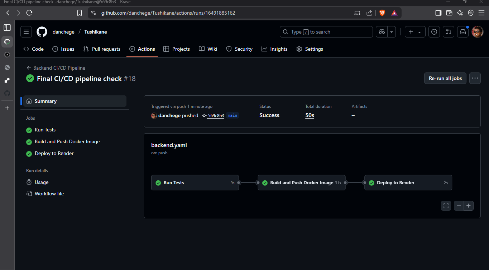

#### Render Backend Logs
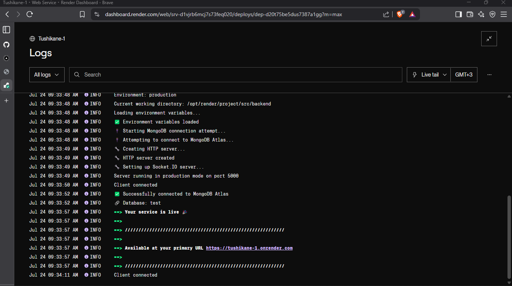

### Frontend (Vercel)
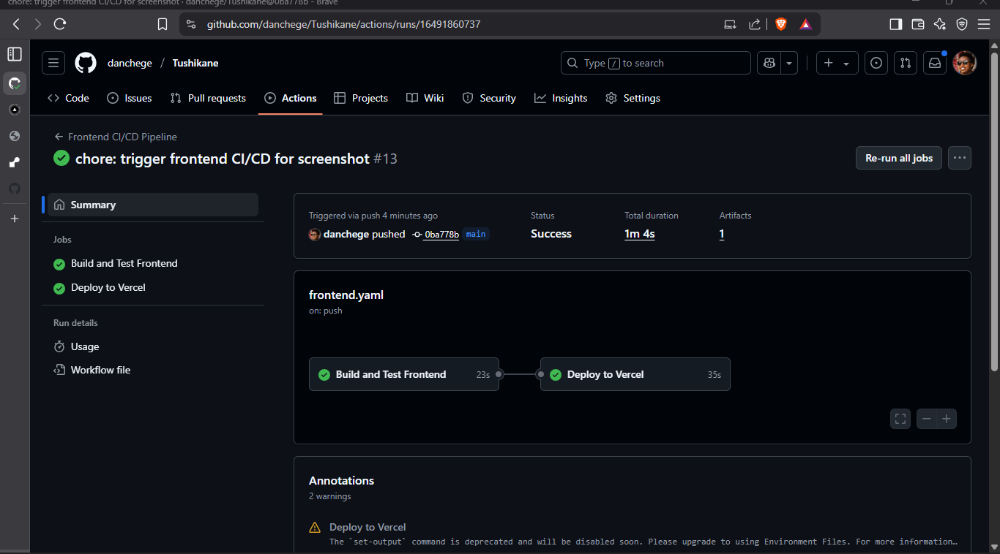

#### Vercel Deployment Screenshot
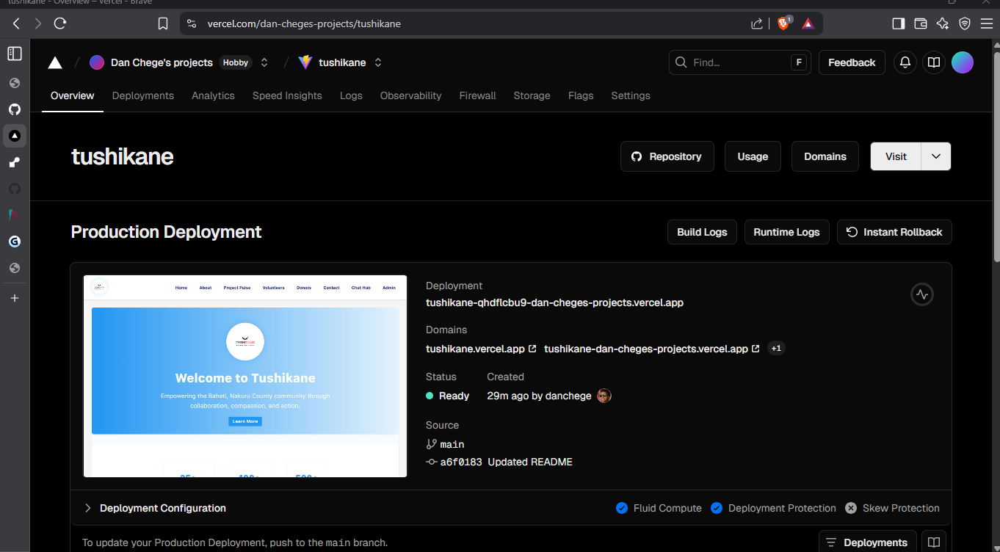

## 🛠️ Technology Stack

### Backend
- **Runtime**: Node.js
- **Framework**: Express.js
- **Database**: MongoDB with Mongoose
- **Authentication**: JWT with `bcryptjs`
- **Real-time**: Socket.IO
- **Security**: Helmet, CORS, Rate Limiting
- **Validation**: express-validator

### Frontend
- **Framework**: React.js with Vite
- **State Management**: React Context / Hooks (can be extended with Redux)
- **UI & Animations**: Framer Motion, CSS
- **HTTP Client**: Axios
- **Routing**: React Router

## 🚀 Quick Start

### Prerequisites
- Node.js (v18 or higher)
- pnpm (recommended for monorepo support)
- MongoDB (local instance or from a provider like MongoDB Atlas)

### Installation & Setup

1.  **Clone the repository:**
    ```bash
    git clone https://github.com/danchege/Tushikane.git
    cd Tushikane
    ```

2.  **Install all dependencies:**
    Run this command from the root directory to install dependencies for both the frontend and backend.
    ```bash
    pnpm install
    ```

3.  **Configure Backend Environment:**
    - Navigate to the `backend` directory.
    - Create a `.env` file by copying the example: `cp .env.example .env` (if you have one) or create it manually.
    - Add your environment variables:
      ```env
      MONGODB_URI=your_mongodb_connection_string
      JWT_SECRET=your_super_secret_jwt_key
      PORT=5000
      ```

4.  **Start Both Frontend and Backend:**
    From the root directory, run:
    ```bash
    pnpm run dev
    ```
    - The backend API will be available at `http://localhost:5000`
    - The frontend will be available at `http://localhost:3002` (or as specified by Vite).

## 📸 Screenshots

```
Tushikane/
└── screenshots/
    ├── home/              # Homepage screenshots
    ├── projectpulse/      # Project Pulse screenshots
    ├── volunteers/        # Volunteers page screenshots
    ├── donors/           # Donors page screenshots
    ├── chathub/          # Chat Hub screenshots
    ├── admin/            # Admin Dashboard screenshots
    └── contact/          # Contact page screenshots
```

### 🏠 Home
- Landing page with key features
- Quick access to main sections
- Community highlights
- Latest updates and announcements

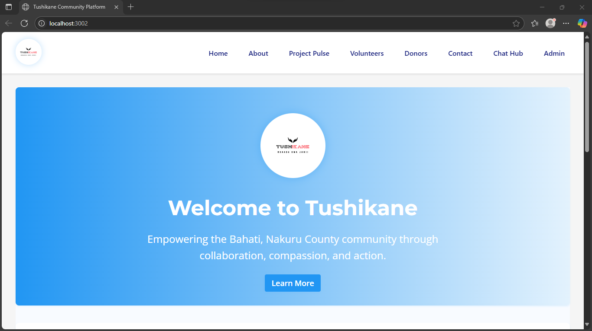

### 🌐 About
- Organization history and mission
- Team information
- Success stories
- Impact statistics
- Community testimonials

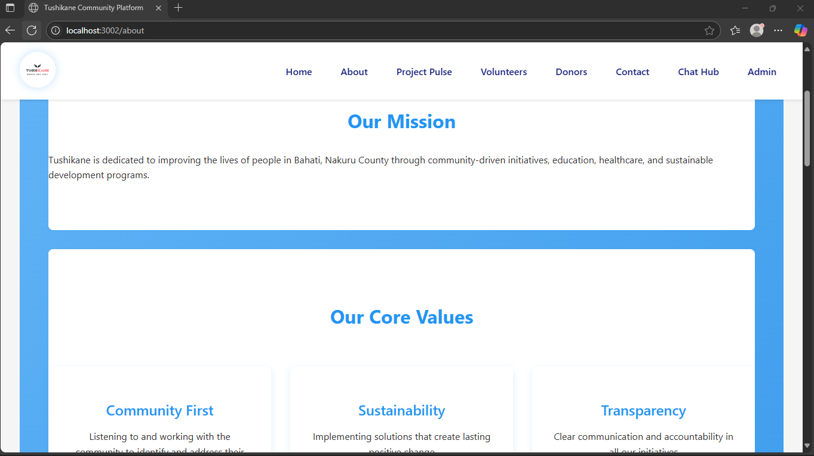

### 📊 Project Pulse
- Real-time project statistics and analytics
- Category-based project filtering
- Status tracking for active projects
- Community impact metrics

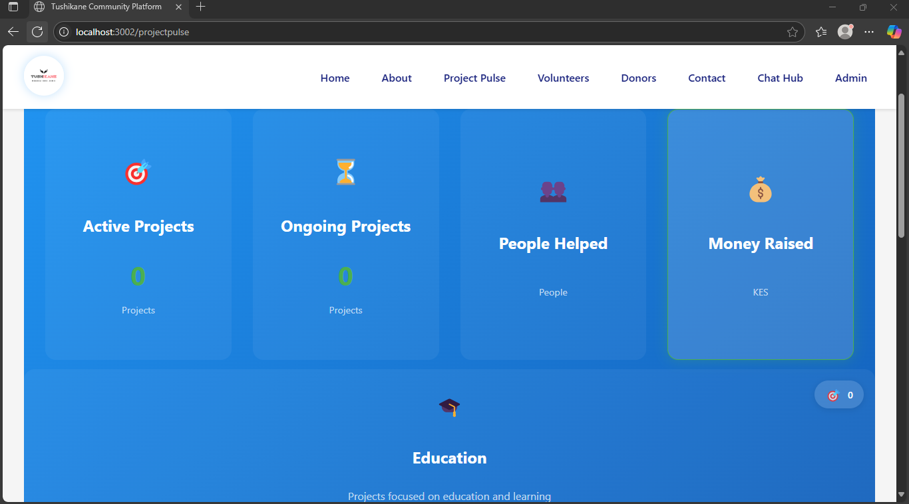

### 👥 Volunteers
- Volunteer registration and management
- Project volunteer matching
- Volunteer application tracking
- Success stories and testimonials

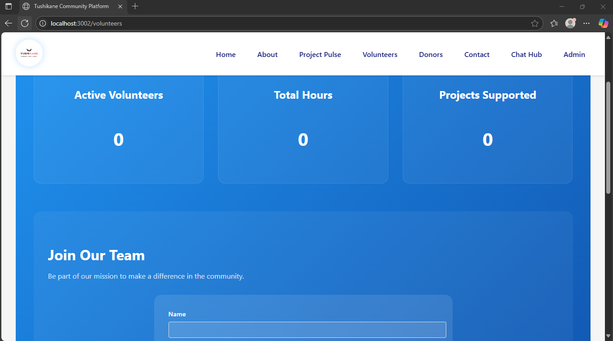

### 💰 Donors
- Project-based donation system
- Donation progress tracking
- Impact reporting
- Donation history management

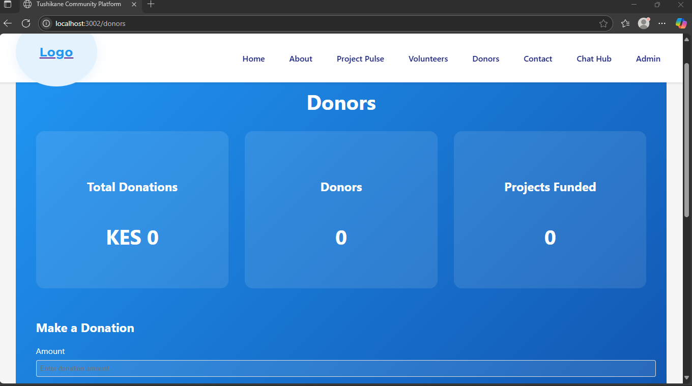

### 📞 Chat Hub
- Real-time community chat
- Direct messaging between volunteers and coordinators
- Group chat for project discussions
- File sharing and emoji support


### 📋 Admin Dashboard
- User management
- Project administration
- Message monitoring
- Statistics and analytics

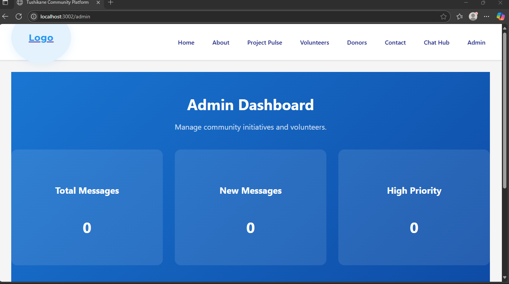

### 📧 Contact
- Community contact information
- Message submission system
- Office hours and location
- Success message feedback

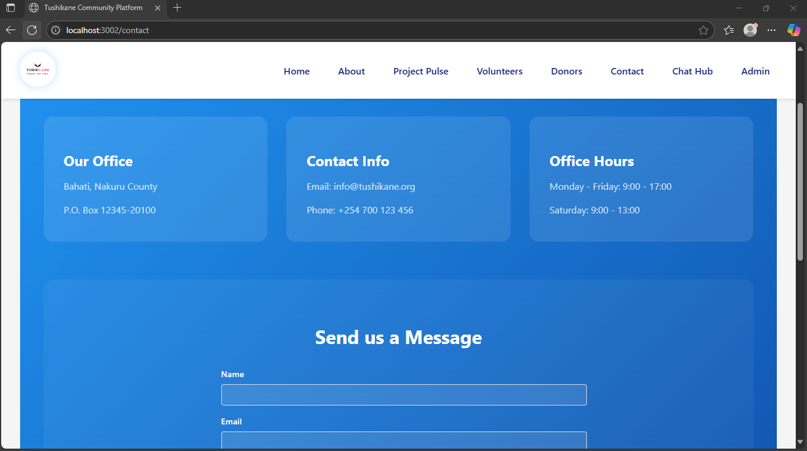

## 🔐 User Roles

### Requester
- Create help requests
- Manage their requests
- Accept/decline volunteer offers
- Update profile information

### Volunteer
- Browse help requests
- Offer help to requests
- View volunteering history
- Update profile information

## 📊 Data Models

### User
```javascript
{
  name: String,
  email: String (unique),
  password: String (hashed),
  role: 'volunteer' | 'requester',
  phone: String,
  location: String,
  bio: String,
  avatar: String,
  isVerified: Boolean
}
```

### Help Request
```javascript
{
  title: String,
  description: String,
  urgency: 'low' | 'medium' | 'high' | 'critical',
  location: String,
  category: String,
  requester: ObjectId,
  status: 'open' | 'in-progress' | 'completed' | 'cancelled',
  volunteers: [{
    volunteer: ObjectId,
    status: 'pending' | 'accepted' | 'declined'
  }]
}
```

## 🤝 Contributing

1. Fork the repository
2. Create a feature branch
3. Make your changes
4. Test thoroughly
5. Submit a pull request

## 📝 License

- This project was part of a PLP Final project under instructor Dedan Okware.

## 👤 Maker

**Daniel Chege Njenga** - Creator and Developer

---

**Tushikane** - Making a difference, one request at a time. 🌍❤️ 
